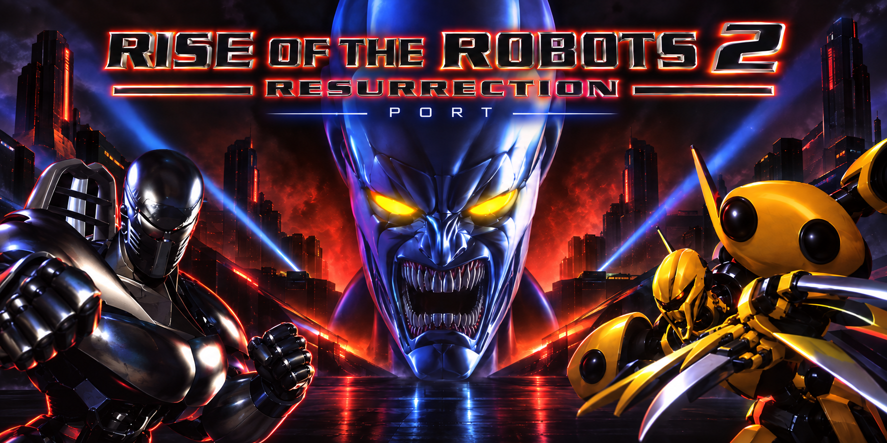

# Rise 2 — Return to the arena



An experimental community port of **Rise 2: Resurrection**, built with C++17 and SDL2. It reconstructs images, movement, collisions and audio from **your own copy of the game**.

This repository contains our code, tools, research notes and project banner. It contains no original game files, extracted artwork, movies, music, DOS executables or decompiler output. Imported and converted data stay on your computer. This is an independent project, unaffiliated with the game's rights holders. Our code and documentation are available under the [MIT license](LICENSE); the game data retain their owners' rights.

## Import your copy

You need **Python 3.12 or later**. On Windows, open PowerShell in this directory:

```powershell
python -m venv .venv
.\.venv\Scripts\python.exe -m pip install -r requirements.txt
.\IMPORTER.cmd
```

Add one or more sources in the import window. You can also add a separate music folder. Choose a different profile name for each edition: an existing profile is never overwritten.

| What you have | What to select |
|---|---|
| A game folder | Select the folder containing the RBT banks, or its parent. An installed folder containing only configuration files is insufficient. |
| A ZIP archive | Select the ZIP. Nested folders are detected. |
| An ISO file | Select the ISO9660 image. CD audio can be supplied separately. |
| A BIN/CUE image | Select the **CUE**, keeping its BIN beside it. The data and numbered CD audio tracks are extracted. |
| A physical Windows CD | Select the drive root. The importer copies data files and reads audio tracks from the drive. This path still needs a test with real optical hardware. |

**Director's Cut needs only Disc 1.** It contains the game, 30 robots and CD audio tracks 02–10.

To mount the data track with Windows' built-in ISO mounter, create a data-only ISO:

```powershell
.\.venv\Scripts\python.exe TOOLS/cue_to_iso.py --cue "D:/Disc 1/RISE2_DC_D1.CUE" --output LOCAL/directors-cut-cd1-data.iso
```

This ISO can test game-data access through a virtual CD drive. It cannot contain CD audio tracks 02–10. To test CDDA reading, mount the original **CUE/BIN** in a virtual drive that exposes audio tracks. A data-only virtual CD remains importable even if it provides no audio TOC.

The importer reads your files without running the installer or any game executable. It neither supplies nor downloads game data.

### Music sources

You can provide WAV, MP3, FLAC, OGG or M4A files in a separate folder or ZIP with `--music`. Use the **original CD track numbers**: `02.mp3`, `03.mp3`, … `10.mp3`. Names such as `Track 02.wav`, `Audio 02.flac` and `Piste 02.mp3` are also recognized. The files are copied without transcoding; the originals stay intact. Duplicate or ambiguous numbers are rejected.

The game also contains **sequenced digital music** in six `MGA`–`MGF` bank pairs (`.MRS` + `.MRW`). These are not ordinary MIDI files. The importer detects and retains their sequences and samples.

The `auto` setting chooses CD audio, then digital music, ambience, then silence according to available data. Explicit choices are `cd`, `digital`, `effects` and `off`. **These are import settings for now:** music playback and the MRS sequencer have not yet been integrated into the port.

### Command line

```powershell
# Game folder plus separately supplied music
.\.venv\Scripts\python.exe TOOLS/import_game.py --source "D:/Games/Rise2" --music "D:/My Tracks" --output LOCAL/my-game

# Director's Cut: Disc 1 alone is sufficient; keep the BIN next to the CUE
.\.venv\Scripts\python.exe TOOLS/import_game.py --source "D:/Disc 1/RISE2_DC_D1.CUE" --output LOCAL/directors-cut

# ZIP or ISO without CD audio: choose the available digital music automatically
.\.venv\Scripts\python.exe TOOLS/import_game.py --source "D:/game.zip" --music-mode auto --output LOCAL/another-copy
```

`--import-only` copies, identifies and checks sources without rebuilding image atlases. `LOCAL/<profile>/import-report.json` records hashes, tracks, the audio mode and any limitations found. Failed imports leave no new profile. Image conversion can take several minutes.

```text
LOCAL/my-game/                 # private, ignored by Git
  game/                       # normalized game files
  sources/                    # extracted discs/archives; bonuses separate
  music/                      # numbered CD tracks and manifest
  EXTRACTED/                  # PNGs, atlases, WAVs, JSON and gallery
  settings.json
  import-report.json
```

## Build and play

The current build targets **Windows x64**, using Visual Studio 2022 with its C++ tools and Windows SDK, plus CMake 3.20 or later. Pinned library releases are downloaded from their official projects and verified by SHA-256:

```powershell
.\.venv\Scripts\python.exe TOOLS/bootstrap_port.py
cmake -S PORT -B PORT/build -G "Visual Studio 17 2022" -A x64
cmake --build PORT/build --config Release
ctest --test-dir PORT/build -C Release --output-on-failure
.\PORT\build\Release\rotr2.exe --assets "$PWD/LOCAL/my-game/EXTRACTED"
```

The current flow shows the logos, title screen, character selection and an initial fight. Enter confirms and Escape goes back. At selection, the arrow keys control player 1 and A/D control player 2. In combat, player 1 uses arrows + J/K and player 2 uses W/A/S/D + I/O. The older edition has 28 robots; Director's Cut adds two more.

The port remains under development: controls and combat are incomplete, some menu options are placeholders, and music still needs to be connected. Only `LLOGO`, `END` and `ENL` are automatically converted into video frames. Other ANI files and bonus content remain in the private profile for future work.

## Extraction and reverse engineering

A normal import **converts data** for the C++ engine. It needs no Ghidra installation and does not turn the DOS executable into a new game automatically. The optional analysis tools use a private profile:

```powershell
# Flatten the LE executable and write its report to this private profile
.\.venv\Scripts\python.exe TOOLS/prepare_analysis.py --profile LOCAL/my-game

# Optional isolated Ghidra project (requires Ghidra, a compatible JDK and pyghidra)
python TOOLS/prepare_analysis.py --profile LOCAL/my-game --ghidra "C:/Tools/ghidra" --java-home "C:/Tools/jdk"
```

Analysis output and decompilation remain local. See the [documentation](documentation/README.md) and the [source-import report](documentation/11_source_imports.md).

## Develop without game files

```powershell
.\.venv\Scripts\python.exe -m unittest discover -s TOOLS/tests -v
.\.venv\Scripts\python.exe TOOLS/test_image_codecs.py
python TOOLS/audit_repo.py --staged
```

After an import, `PORT/build/Release/rotr2_asset_smoke.exe LOCAL/my-game/EXTRACTED` checks menus and every robot bank without opening a window.

Automated tests build small synthetic disc images and samples; they need no original game data. The Git index audit allows only known code and documentation paths plus the project banner. `SRC`, `LOCAL`, `EXTRACTED`, captures, Ghidra projects, builds and downloaded dependencies are excluded.

Before release, the physical-CD path still needs real hardware validation. SDL2/SDL2_image, nlohmann/json, Pillow and pycdlib retain their own licenses; see their distributions.
